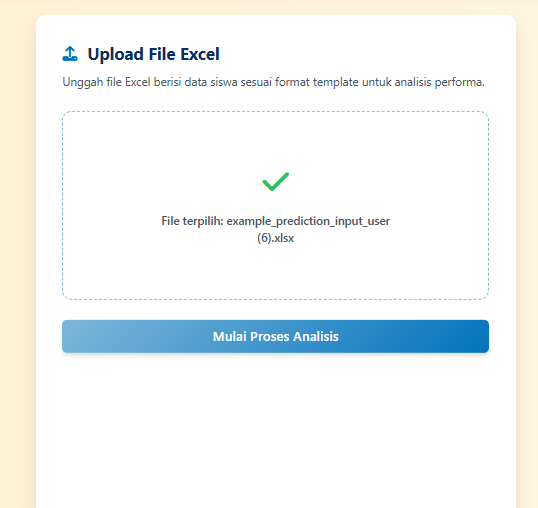

# EduCare: Solusi Cerdas untuk Pengelolaan Data Siswa yang Lebih Cepat dan Tepat

  

## Tentang EduCare
EduCare adalah platform web terpadu yang dirancang untuk membantu sekolah menengah mengelola data siswa dan merencanakan intervensi belajar secara proaktif. Dengan pendekatan berbasis data, EduCare memanfaatkan teknologi *machine learning* untuk memprediksi performa akademik, mengidentifikasi siswa berisiko, mengelompokkan potensi siswa, dan merekomendasikan mata pelajaran pilihan. Platform ini memungkinkan pengambilan keputusan yang lebih cepat, tepat, dan efisien.

EduCare mengintegrasikan analisis data dari file Excel, menghasilkan wawasan yang mudah dipahami, dan menyediakan laporan dalam format yang praktis. Dengan antarmuka yang responsif dan ramah pengguna, EduCare dirancang untuk memudahkan penggunaan oleh guru, staf sekolah, dan administrator.

## Daftar Isi
1. [Tentang EduCare](#tentang-educare)
2. [Fitur Utama](#fitur-utama)
3. [Alat, Layanan, dan Pustaka](#alat-layanan-dan-pustaka)
4. [Kunjungi Website](#kunjungi-website)
5. [Panduan Penggunaan](#panduan-penggunaan)
6. [Tim Kami](#tim-kami)

## Fitur Utama
EduCare menawarkan empat fitur utama untuk mendukung pengelolaan data siswa dan pengambilan keputusan berbasis data:

### 1. Proyeksi Performa Akademik
Menggunakan algoritma regresi untuk memprediksi nilai ujian siswa berdasarkan faktor seperti jam belajar, kehadiran, nilai sebelumnya, dan kondisi sosial-ekonomi.

  

### 2. Klasifikasi Peduli Siswa
Mengidentifikasi siswa dengan risiko akademik atau sosial menggunakan model klasifikasi, memungkinkan intervensi yang tepat waktu.

  

### 3. Segmentasi Potensi Siswa
Menggunakan algoritma *clustering* untuk mengelompokkan siswa berdasarkan karakteristik belajar, mendukung strategi pembelajaran yang dipersonalisasi.

  

### 4. Rekomendasi Mata Pelajaran Pilihan
Memberikan rekomendasi mata pelajaran berdasarkan minat dan potensi siswa, membantu siswa SMA memilih jalur akademik yang sesuai.

  

## Alat, Layanan, dan Pustaka
Berikut adalah teknologi yang digunakan dalam pengembangan EduCare:
- **Machine Learning**: TensorFlow, Keras, Scikit-learn, XGBoost, Joblib
- **Pengolahan Data**: NumPy, Pandas
- **Visualisasi Data**: Matplotlib, Seaborn
- **Backend**: Express.js
- **Frontend**: Embedded JavaScript Templates (EJS)

## Kunjungi Website
Akses EduCare di: [https://educare-app-production.up.railway.app/](https://educare-app-production.up.railway.app/)

## Panduan Penggunaan
Berikut adalah langkah-langkah untuk menggunakan fitur EduCare:

### 1. Mengakses Platform
- Kunjungi [https://educare-app-production.up.railway.app/](https://educare-app-production.up.railway.app/) melalui browser.
- Halaman utama menampilkan gambaran umum fitur EduCare.

  

### 2. Menjelajahi Fitur
- Klik menu **Layanan** pada navigasi atas untuk melihat daftar fitur.

  

- Pilih fitur yang diinginkan, seperti **Proyeksi Performa Akademik**.

  

### 3. Menggunakan Layanan
Setiap fitur mengikuti alur kerja berikut:
1. **Unduh Template Excel**:
   - Klik **Download Template Excel** pada halaman layanan.
   - Template berisi kolom wajib, seperti:
     - **Prediksi**: `Student`, `Hours_Studied`, `Attendance`, dll. (gunakan `ya/tidak` untuk kolom biner).
     - **Klasifikasi/Segmentasi**: `n_sikap_a`, `n_kejuruan`, dll. (gunakan `TRUE/FALSE` atau `0/1`).
     - **Rekomendasi**: `student_id`, `interest_math`, dll. (skala 1-5).

     

      
    

2. **Isi Data Siswa**:
   - Buka template di aplikasi spreadsheet (contoh: Microsoft Excel).
   - Isi data sesuai panduan:
     - Jangan biarkan kolom kosong.
     - Gunakan format yang benar (angka untuk numerik, `ya/tidak` atau `TRUE/FALSE` untuk biner).
   - Simpan dalam format `.xlsx` atau `.xls`.

       

      
    

3. **Unggah File**:
   - Klik **Upload File Excel** atau lakukan *drag-and-drop*.

    

      
    

   - Klik **Mulai Proses Analisis** setelah file terpilih.

    

      
    

4. **Lihat Proses Analisis**:
   - Progress bar akan menunjukkan status analisis.
   - Sistem memproses data menggunakan algoritma *machine learning*.

       

      
    

5. **Tinjau Hasil**:
   - Hasil analisis ditampilkan dalam tabel (pratinjau maksimum 5 baris).
   - Unduh laporan lengkap dengan klik **Download Hasil Lengkap (Excel)**.

    

      
    

### 4. Informasi Tambahan

  

- Kunjungi halaman **Info** untuk:
  - **FAQ**: Jawaban atas pertanyaan umum.
  - **Panduan Penggunaan**: Tips penggunaan dan penerapan hasil.
  - **Detail Fitur**: Penjelasan mendalam tentang setiap layanan.

### 5. Kontak Dukungan
Jika mengalami kendala, hubungi kami melalui:
- **Email**: info@educare.com
- **Telepon**: +6285702220093
- **Lokasi**: Indonesia

### Tips Penggunaan
- Pastikan file Excel sesuai template untuk menghindari error.
- Gunakan browser modern (Chrome, Firefox, Edge) untuk performa optimal.
- Manfaatkan hasil analisis untuk merencanakan intervensi atau strategi pembelajaran.

## Tim Kami

  

Kami adalah tim yang berdedikasi untuk menghadirkan solusi inovatif bagi dunia pendidikan:

| ID            | Nama                  | Universitas                          |
|---------------|-----------------------|--------------------------------------|
| A268YBF524    | Zulfikar Setyo Priyambudi | Universitas Muhammadiyah Surakarta   |
| A872YBM394    | Pramauladi M.         | Universitas Islam Negeri Raden Fatah |
| A268YBM492    | Vio Arvendha          | Universitas Muhammadiyah Surakarta   |
| A007YBF409    | Raihan Nadhif         | Universitas Dian Nuswantoro          |
